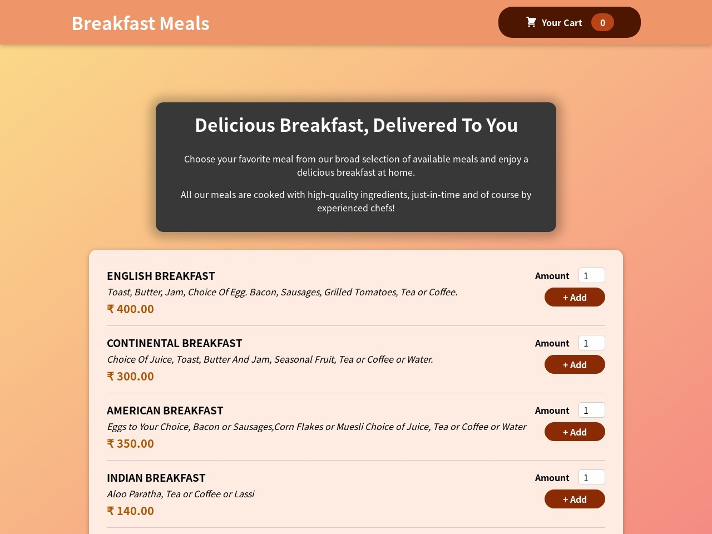

# BreakFast Meals



## Demo

[View Demo](https://react-food-appgit.web.app/)

## About The Project

Breakfast Meals is an application built using
React JS and uses firebase as a dummy backend to place
orders. This app uses modern React Hooks such as
useReducer, useState, useEffect, useRef ..etc
. This application was
built using Context API for global state management.
The user can add required meals to the cart
,view them in cart section as well as place order after
adding necessary details.

## Built Using

Breakfast Meals is built with React JS along with HTML and CSS.
It uses Context API for global state management
, NPM as package manager and firebase
as dummy backened

- React Hooks
- HTML
- CSS
- NPM
- Context API

## Getting Started

To get started with project just simply fork this repo or download locally on your System.

To get a local copy up and running follow these simple example steps.

Prerequisites
Start with the latest version of NPM to avoid any errors:

## Prerequisites

Start with the latest version of NPM to avoid any errors:

```bash
  npm install npm@latest -g
```

## Installation

1). Get a firebase account, set up the project add the dummy meals data for the menu on the firebase & and get the project URL.

2). Open Cart.js and replace the link in submitOrderhandler
function with
the link from firebase and adding "/orders.json" at the end of link.

3). Open AvailableMeals.js and replace the link in the fetchMeals function
with
the link from firebase and adding "/meals.json" at the end of link.

4). On the firebase console go to hosting and follow the necessary steps by running
commands in the terminal.

5). After successfully executing the firebase commands use the obtained link to access the app

## Available Scripts

In the project directory, you can run:

```bash
 npm start
```

Runs the app in the development mode.
Open http://localhost:3000 to view it in your browser.

```bash
npm run build
```

Builds the app for production to the build folder.
It correctly bundles React in production mode and optimizes the build for the best performance.

The build is minified uses only necessary files, the filenames include the hashes.
Your app is ready to be deployed!

## Usage

- Breakfast Meals allows users to order breakfast
- Users can add their desired meals from menu and place the orders by sending data to dummy backened
